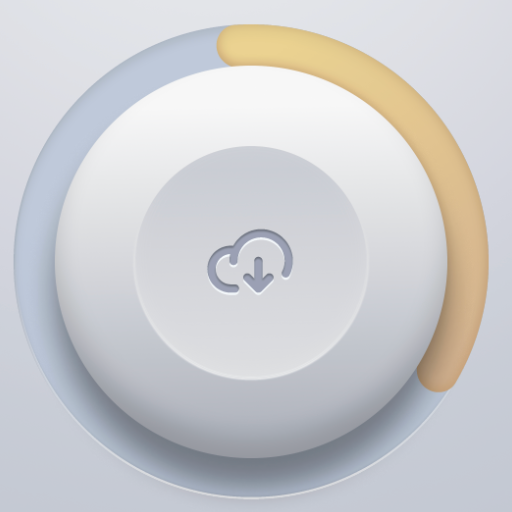
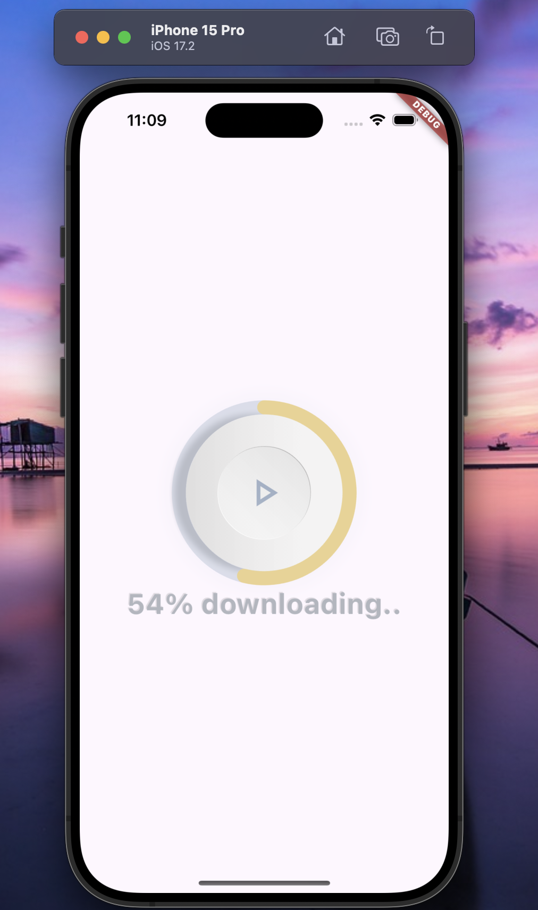
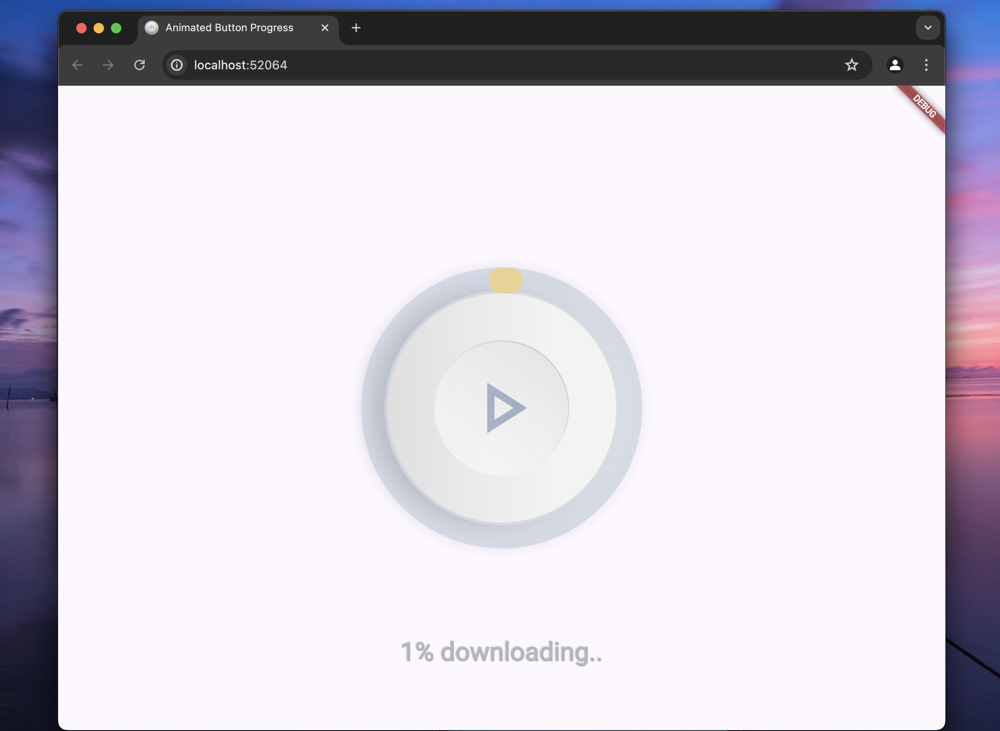

<div align="center">
   

## Animated Button fun project

<strong> Animated button with progress indicator </strong>

<br/>
[Figma link](https://www.figma.com/design/bNb6HRLZyGIFrPdCOOhf7A/Free-button-down?m=auto&t=RfX1SYFeF6ksq4pR-6) <br/>
[Get APK here](https://drive.google.com/drive/u/0/folders/1JiqyjuY2ybc49v5xv7TmqjdiujqdHEgB)

<sub>Built by <a href="https://twitter.com/_Captured_Heart">Nkpozi Marcel Kelechi</a></sub>
<br />

## AN INTRO VIDEO OF THE APP


</div>

---

## Getting Started

After cloning,

### FVM setup

it runs on flutter version: flutter: ">=3.18.0-18.0.pre.54", dart: ">=3.4.1 <4.0.0",

Install `fvm` if not already installed.

```bash
dart pub global activate fvm
```

Install the local `flutter` version.

```bash
fvm install
```

---

## UI Shots

<div style="text-align: center">
  <table>
    <tr>
      <td style="text-align: center">
        
      </td>
      <td style="text-align: center">
        
      </td>
    </tr>
  </table>
</div>

## Tools

- [gusto_neumorphic](https://pub.dev/packages/gusto_neumorphic): A complete, ready to use, Neumorphic ui kit for Flutter.
- [auto_size_text](https://pub.dev/packages/auto_size_text): Flutter widget that automatically resizes text to fit perfectly within its bounds.
